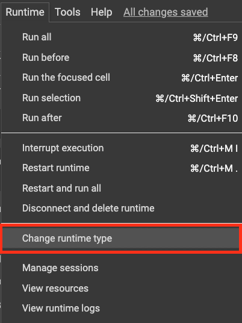
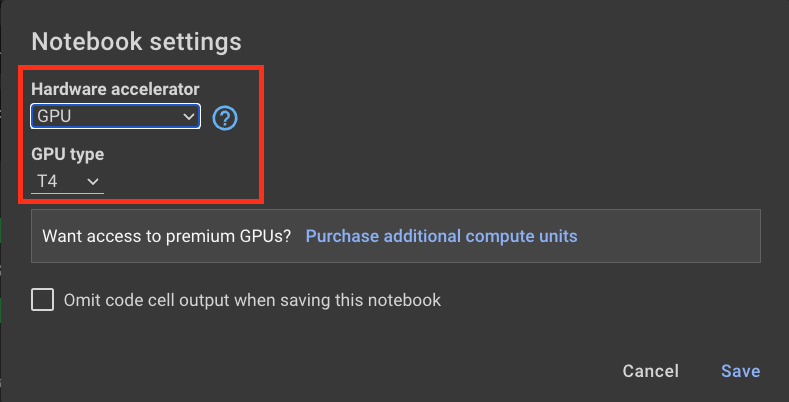

# Masterclass Informativa: Descubre los fundamentos de la Ciencia de Datos

Bienvenid@ a esta edición exclusiva de ciencia de datos. En el transcurso de la sesión realizaremos algunos ejercicios para que puedas introducirte al apasionante mundo de la ciencia de datos.

Como parte de la ejercitación realizaremos las siguientes actividades:

1. Crear un notebook
2. Descargar una fuente de datos y realizar algunas transformaciones básicas para poder analizar
3. Conectarnos a OpenAI y utilizar el poder de las redes generativas para poder contestar preguntas
4. Implementar difusores para generar imágenes.

Para poder trabajar con los ejercicios de difusores, es importante que tengas habilitado el `Runtime` con `GPU`. Esto permite invocar las librerías requeridas para poder trabajar con las redes generativas.

Para ello, dentro de Colab, te diriges al menu de `Runtime`

Y Luego configuras el entorno en `GPU`

Esto lo debes realizar para cada nuevo notebook que trabajes.

---

Para comenzar con las actividades puedes dirigirte al apartado [Notebooks](./1.notebooks/) y abrir el primer ejercicio.

**Esperamos te diviertas! no dudes en consultar!**

